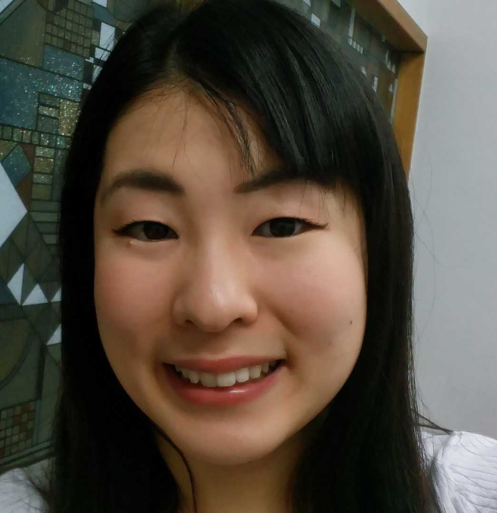
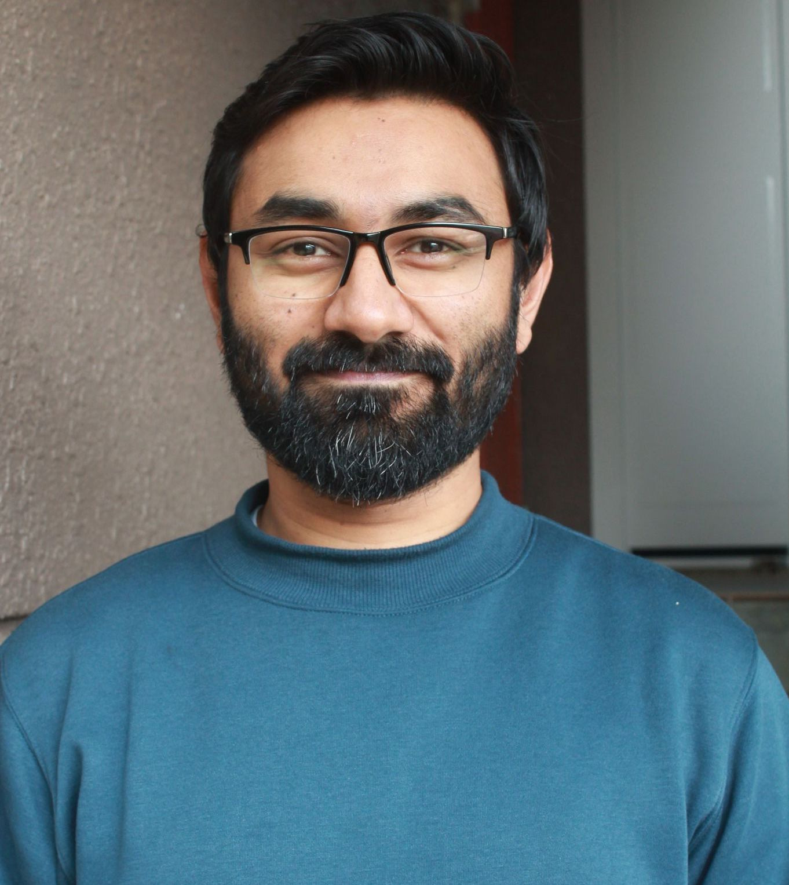
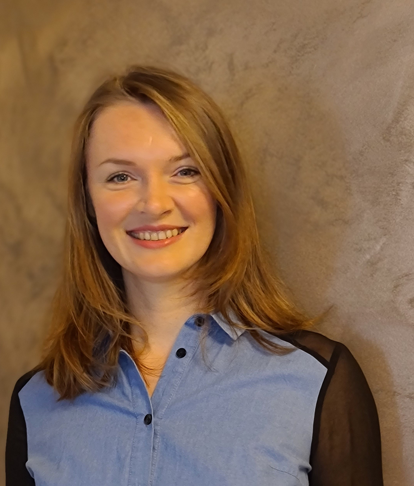
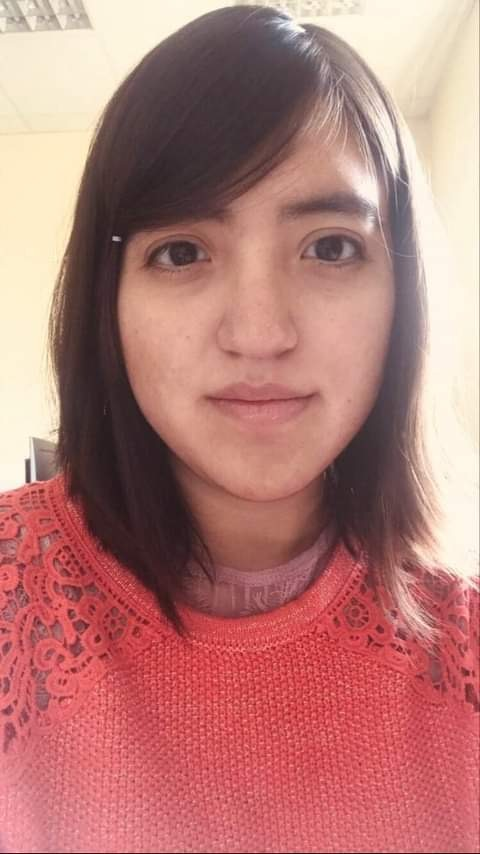

<div style="width: 30%; float: right;">


#### Sponsors

```{r ut_sponsors, echo=FALSE, out.width = '52%', fig.align='left'}
knitr::include_graphics("imgs/ut2.png")
```

-----

```{r uga_sponsors, echo=FALSE, out.width = '42%', fig.align='left'}
knitr::include_graphics("imgs/uga2.png")
```

-----

```{r cnrs, echo=FALSE, out.width = '42%', fig.align='left'}
knitr::include_graphics("imgs/cnrs.png")
```

-----


```{r region, echo=FALSE, out.width = '72%', fig.align='left'}
knitr::include_graphics("imgs/region.png")
```


</div>


 
<div style="width: 65%; float: left;">

<br/>

-----

## Co-chairs

-----

<div>

<div style="width: 49%; float: left"> 

#### Souza	Lincon	
PhD Student
```{r Souza, echo=FALSE, out.width = '42%', fig.align='left'}
knitr::include_graphics("imgs/lincon.jpg")
```

</div>

<div style="width: 49%; float: right"> 

#### Jouni	Mohamad
PhD	Student
```{r JOUNI, echo=FALSE, out.width = '40%', fig.align='left'}
knitr::include_graphics("imgs/jouni.jpg")
```

</div>

<br/>

<br/>
<br/>

<br/>
<br/>
<br/>


-----

<br/>

<br/>
<br/>

<br/>


It is our great pleasure to warmly invite you to the 2020 UGA & UT Workshop, between the University of Grenoble Alpes (UGA) and the University of Tsukuba (UT) as part of their academic partnership. Here, we hope to promote the international exchange of expertise even further. Our vision is that this student-organized event will create new research opportunities, encourage open and independent mindsets, and increase the scientific network among our working groups.


-----

## General Organization

-----

<div style="width: 49%; float: left;"> 

### University of Tsukuba

#### Lavinas Yuri
PhD Student
```{r Lavinas, echo=FALSE, out.width = '46%', fig.align='left'}
knitr::include_graphics("imgs/myself3.png")
```

-----

#### Fujinaka	Ayano
PhD Student 
```{r Fujinaka, echo=FALSE, out.width = '46%', fig.align='left'}

```

-----

#### Shimomoto Erica	
PhD	Student
```{r Shimomoto, echo=FALSE, out.width = '35%', fig.align='left'}
knitr::include_graphics("imgs/erica.jpg")
```

-----


#### Bourahmoune Katia
PhD	Student
```{r Bourahmoune, echo=FALSE, out.width = '40%', fig.align='left'}
knitr::include_graphics("imgs/katia2.png")
```

-----


#### Pereira Jair
Master	Student
```{r Pereira, echo=FALSE, out.width = '40%', fig.align='left'}
knitr::include_graphics("imgs/jair.jpeg")
```

-----


#### Vijdan	Khalique 	
PhD	Student
```{r Vijdan, echo=FALSE, out.width = '40%', fig.align='left'}

```

-----

#### Naoya Sogi
PhD	Student
```{r Naoya, echo=FALSE, out.width = '40%', fig.align='left'}
knitr::include_graphics("imgs/missing_avatar.svg")
```

</div>

<div style="width: 49%; float: right;"> 

### University of Grenoble-Alpes

#### Foussard	Ernest
PhD Student
```{r Foussard, echo=FALSE, out.width = '39%', fig.align='left'}
knitr::include_graphics("imgs/Ernest.jpg")
```

-----


#### Shalaeva	Vera
Post-doc Researcher
```{r SHALAEVA, echo=FALSE, out.width = '40.5%', fig.align='left'}

```

-----

#### Resendiz	Mariel
PhD Student
```{r RESENDIZ, echo=FALSE, out.width = '40%', fig.align='left'}

```

<!-- ----- -->

<!-- #### Reinke Chris -->
<!-- Post-doc Researcher -->
<!-- ```{r REINKE, echo=FALSE, out.width = '40%', fig.align='left'} -->
<!-- knitr::include_graphics("imgs/missing_avatar.svg") -->
<!-- ``` -->


<!-- ----- -->

<!-- #### Guhur Pierre-Louis -->
<!-- PhD	Student -->
<!-- ```{r GUHUR, echo=FALSE, out.width = '40%', fig.align='left'} -->
<!-- knitr::include_graphics("imgs/missing_avatar.svg") -->
<!-- ``` -->

<!-- ----- -->

<!-- #### Zrigui	Salah -->
<!-- PhD	Student -->
<!-- ```{r ZRIGUI, echo=FALSE, out.width = '40%', fig.align='left'} -->
<!-- knitr::include_graphics("imgs/missing_avatar.svg") -->
<!-- ``` -->

-----

<!-- #### Koelsch Loriane -->
<!-- PhD Student -->
<!-- ```{r KOELSCH, echo=FALSE, out.width = '40%', fig.align='left'} -->
<!-- knitr::include_graphics("imgs/missing_avatar.svg") -->
<!-- ``` -->

<!-- ----- -->


#### Petit	Pascal
Post-doc Researcher
```{r Petit, echo=FALSE, out.width = '40%', fig.align='left'}
knitr::include_graphics("imgs/missing_avatar.svg")
```


</div>
</div>
