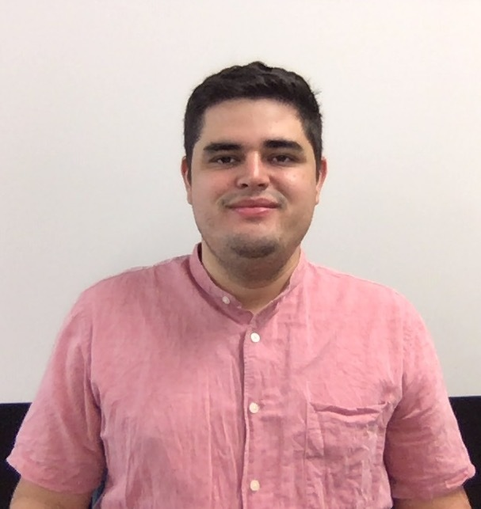
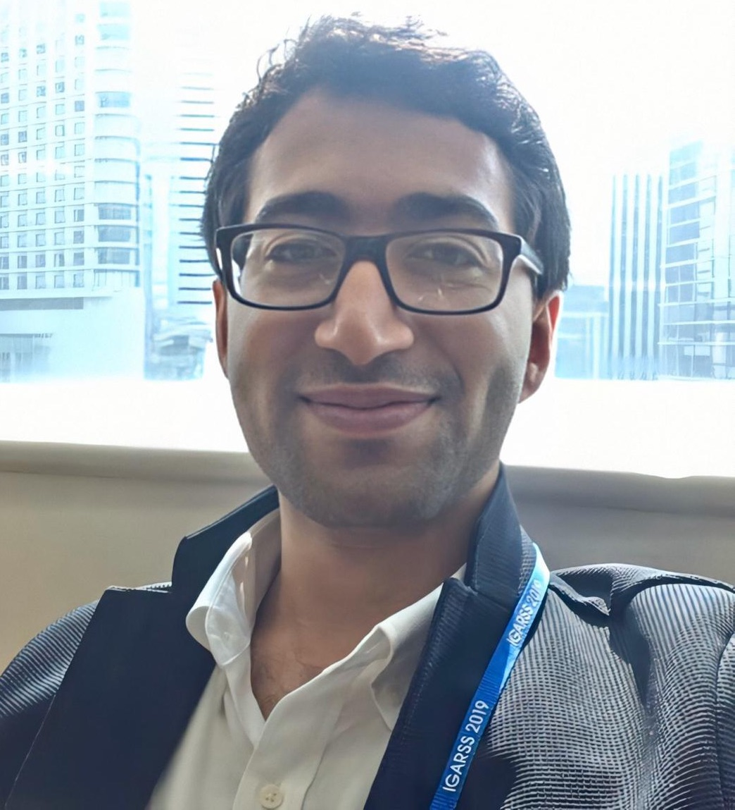

<br/>

-----

## Co-chairs

-----

<div>

<div style="width: 49%; float: left"> 

#### Souza	Lincon	
PHD Student
```{r Souza, echo=FALSE, out.width = '42%', fig.align='left'}

```

</div>

<div style="width: 49%; float: right"> 

#### Jouni	Mohamad
PhD	Student
```{r JOUNI, echo=FALSE, out.width = '40%', fig.align='left'}

```

</div>

<br/>

<br/>

<br/>

<br/>

<br/>

<br/>

<br/>

<br/>


-----

## Organization

-----

<div style="width: 49%; float: left;"> 

### Univeristy of Tsukuba

#### Lavinas Yuri
PHD Student
```{r Lavinas, echo=FALSE, out.width = '46%', fig.align='left'}
knitr::include_graphics("imgs/myself3.png")
```

-----

#### Fujinaka	Ayano
PHD Student 
```{r Fujinaka, echo=FALSE, out.width = '46%', fig.align='left'}
knitr::include_graphics("imgs/fujinaka.png")
```

-----

#### Shimomoto Erica	
PHD	Student
```{r Shimomoto, echo=FALSE, out.width = '35%', fig.align='left'}

```

-----


#### Bourahmoune Katia
PHD	Student
```{r Bourahmoune, echo=FALSE, out.width = '40%', fig.align='left'}
knitr::include_graphics("imgs/katia2.png")
```

-----


#### Pereira Jair
Master	Student
```{r Pereira, echo=FALSE, out.width = '40%', fig.align='left'}
knitr::include_graphics("imgs/jair.jpeg")
```

-----


#### Vijdan	Khalique 	
PHD	Student
```{r Vijdan, echo=FALSE, out.width = '40%', fig.align='left'}
knitr::include_graphics("imgs/vijdan.jpg")
```

-----

#### Naoya Sogi
PHD	Student
```{r Naoya, echo=FALSE, out.width = '40%', fig.align='left'}
knitr::include_graphics("imgs/missing_avatar.svg")
```

</div>

<div style="width: 49%; float: right;"> 

### Univeristy of Grenoble-Alpes

#### Foussard	Ernest
PhD Student
```{r Foussard, echo=FALSE, out.width = '39%', fig.align='left'}

```

-----


#### Shalaeva	Vera
Post-doc Researcher
```{r SHALAEVA, echo=FALSE, out.width = '40.5%', fig.align='left'}

```

-----

#### Reinke Chris
Post-doc Researcher
```{r REINKE, echo=FALSE, out.width = '40%', fig.align='left'}
knitr::include_graphics("imgs/missing_avatar.svg")
```


-----

#### Guhur Pierre-Louis
PhD	Student
```{r GUHUR, echo=FALSE, out.width = '40%', fig.align='left'}
knitr::include_graphics("imgs/missing_avatar.svg")
```

-----

#### Zrigui	Salah
PhD	Student
```{r ZRIGUI, echo=FALSE, out.width = '40%', fig.align='left'}
knitr::include_graphics("imgs/missing_avatar.svg")
```

-----

#### Koelsch Loriane
PhD Student
```{r KOELSCH, echo=FALSE, out.width = '40%', fig.align='left'}
knitr::include_graphics("imgs/missing_avatar.svg")
```

-----

#### Resediz	Mariel
PHD Student
```{r RESENDIZ, echo=FALSE, out.width = '40%', fig.align='left'}
knitr::include_graphics("imgs/missing_avatar.svg")
```

-----

#### Petit	Pascal
Post-doc Researcher
```{r Petit, echo=FALSE, out.width = '40%', fig.align='left'}
knitr::include_graphics("imgs/missing_avatar.svg")
```


</div>
