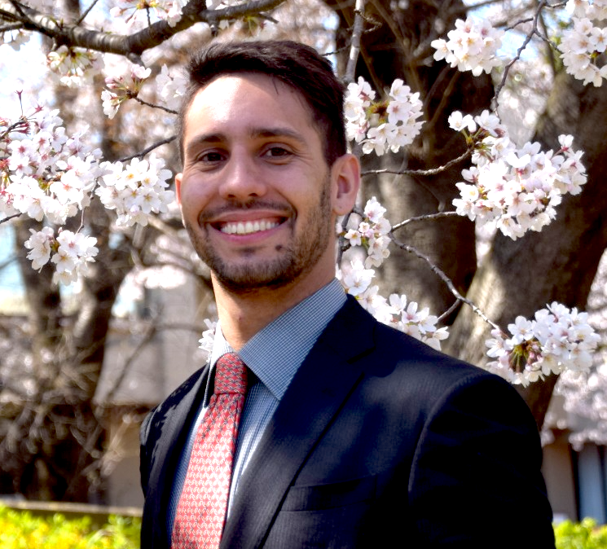

<br/>

-----

## Coordinators

-----

<div>

<div style="width: 49%; float: left"> 

```{r FUKUI, echo=FALSE, out.width = '30%', fig.align='left'}
knitr::include_graphics("imgs/missing_avatar.svg")
```

#### FUKUI	Kazuhiro, University of Tsukuba

</div>


<div style="width: 49%; float: right"> 

```{r BOUSQUET, echo=FALSE, out.width = '30%', fig.align='left'}
knitr::include_graphics("imgs/missing_avatar.svg")
```

#### Lydie du Bousquet, University of Grenoble Alps

</div>

</div>

<br/>

<br/>

<br/>

<br/>

<br/>

<br/>

<br/>

<br/>


-----

## Organization

-----

<div style="width: 49%; float: left;"> 

### Univeristy of Tsukuba Members

#### Souza	Lincon	
PHD Student
```{r Souza, echo=FALSE, out.width = '30%', fig.align='left'}
knitr::include_graphics("imgs/lincon.jpg")
```

#### Lavinas Yuri
PHD Student
```{r Lavinas, echo=FALSE, out.width = '30%', fig.align='left'}

```

#### Fujinaka	Ayano
PHD Student 
```{r Fujinaka, echo=FALSE, out.width = '30%', fig.align='left'}

```


#### Shimomoto Erica	
PHD	Tsukuba
```{r Shimomoto, echo=FALSE, out.width = '30%', fig.align='left'}
knitr::include_graphics("imgs/erica.jpg")
```

#### Bourahmoune Katia
PHD	Tsukuba
```{r Bourahmoune, echo=FALSE, out.width = '30%', fig.align='left'}
knitr::include_graphics("imgs/katia.jpg")
```

#### Pereira Jair
Master	Tsukuba
```{r Pereira, echo=FALSE, out.width = '30%', fig.align='left'}
knitr::include_graphics("imgs/jair.jpeg")
```

#### Vijdan	Khalique 	
PHD	Tsukuba
```{r Vijdan, echo=FALSE, out.width = '30%', fig.align='left'}
knitr::include_graphics("imgs/missing_avatar.svg")
```

#### Naoya Sogi
PHD	Tsukuba
```{r Naoya, echo=FALSE, out.width = '30%', fig.align='left'}
knitr::include_graphics("imgs/missing_avatar.svg")
```

</div>

<div style="width: 49%; float: right;"> 

### Univeristy of Grenoble Members

#### Jouni	Mohamad
PhD	
```{r JOUNI, echo=FALSE, out.width = '30%', fig.align='left'}
knitr::include_graphics("imgs/jouni.jpg")
```

#### Foussard	Ernest
PhD
```{r Foussard, echo=FALSE, out.width = '30%', fig.align='left'}
knitr::include_graphics("imgs/Ernest.jpg")
```

#### Reinke Chris
Post-doc
```{r REINKE, echo=FALSE, out.width = '30%', fig.align='left'}
knitr::include_graphics("imgs/missing_avatar.svg")
```

#### Shalaeva	Vera
Post-doc
```{r SHALAEVA, echo=FALSE, out.width = '30%', fig.align='left'}
knitr::include_graphics("imgs/missing_avatar.svg")
```


#### Guhur Pierre-Louis
PhD	
```{r GUHUR, echo=FALSE, out.width = '30%', fig.align='left'}
knitr::include_graphics("imgs/missing_avatar.svg")
```

#### Zrigui	Salah
PhD	
```{r ZRIGUI, echo=FALSE, out.width = '30%', fig.align='left'}
knitr::include_graphics("imgs/missing_avatar.svg")
```

#### Koelsch Loriane
PhD
```{r KOELSCH, echo=FALSE, out.width = '30%', fig.align='left'}
knitr::include_graphics("imgs/missing_avatar.svg")
```

#### Resediz	Mariel
PHD
```{r RESENDIZ, echo=FALSE, out.width = '30%', fig.align='left'}
knitr::include_graphics("imgs/missing_avatar.svg")
```

#### Petit	Pascal
Post-doc
```{r Petit, echo=FALSE, out.width = '30%', fig.align='left'}
knitr::include_graphics("imgs/missing_avatar.svg")
```


</div>
