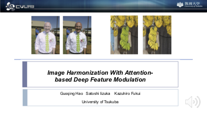
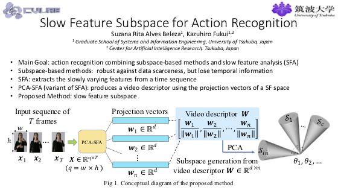
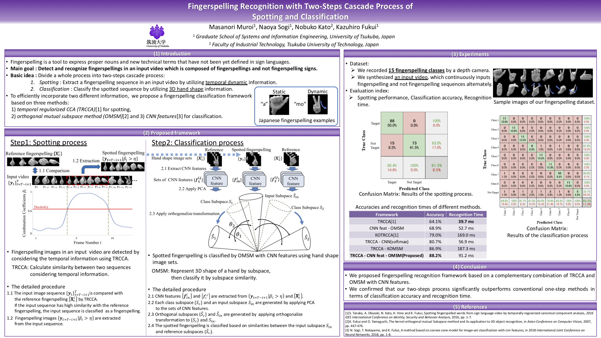
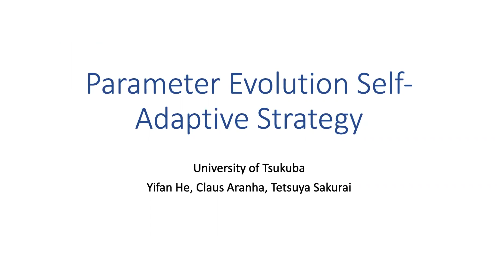
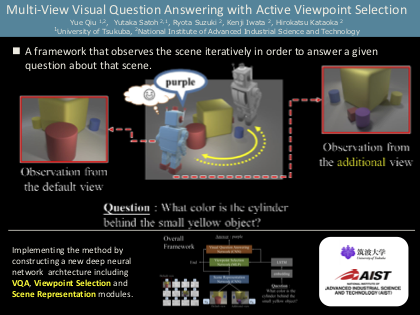
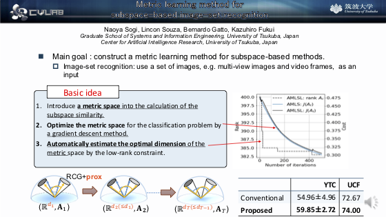
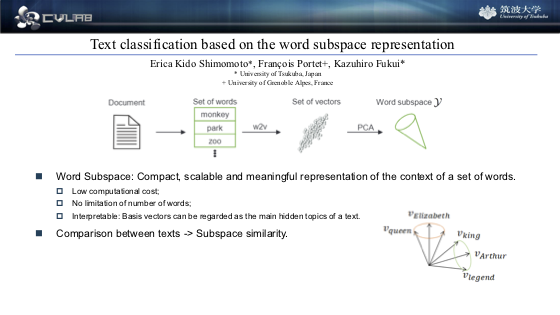

<div style="width: 30%; float: right;">


#### Sponsors


```{r ut_sponsors, echo=FALSE, out.width = '52%', fig.align='left'}

```

-----

```{r uga_sponsors, echo=FALSE, out.width = '42%', fig.align='left'}

```

-----

```{r cnrs, echo=FALSE, out.width = '42%', fig.align='left'}

```

-----


```{r region, echo=FALSE, out.width = '72%', fig.align='left'}

```


</div>


 
<div style="width: 65%; float: left;">

### Want to have an idea about what the poster presentations will be about? You can check their spotlight videos here!

-----

### 01: Fujinaka	Ayano
#### Segmentation of intervertebral disks from videofluorography based on CNN, multi-channelization, and feature selection

This research contains sensitive information on hospitalised patients. Therefore, we cannot make public the data on the website.
Here at the website, we can download the password-protected zip files with the Spotlight video and slides.
For more information please and access to the password contact Fujinaka	Ayano by [e-mail](mailto:s1830149@s.tsukuba.ac.jp).

We appreciate your understanding.


<div style="width: 49%; float: left"> 

- Video

[](videos/Fujinaka/spotlight_video.zip "Fujinaka")

-----

</div>

- Slides

<div style="width: 49%; float: right"> 

[](videos/Fujinaka/splotlight_slides.zip "Fujinaka")

-----

</div>

-----

-----

### 02: Guoqing Hao
#### Image Harmonization With Attention- based Deep Feature Modulation.


<div style="width: 49%; float: left"> 

- Video

[](videos/Hao/UGA_UT_hao_spotlight.mp4 "Hao")

-----

</div>

<div style="width: 49%; float: right"> 

- Slides

[](videos/Hao/UGA_UT_hao_spotlight.pdf "Hao")

-----

</div>

-----

-----

### 03: Rita Suzana
#### Image Harmonization With Attention- based Deep Feature Modulation.


<div style="width: 49%; float: left"> 

- Video

[](videos/suzana/suzana_spotlight_slides.mp4 "suzana")

-----

</div>

- Slides

<div style="width: 49%; float: right"> 

[](videos/suzana/suzana_spotlight_slides.pdf "suzana")

-----

</div>


### 04: Masanori Muroi
#### Fingerspelling Recognition with Two-Steps Cascade Process of Spotting and Classification

<div style="width: 49%; float: left"> 

- Video

[](videos/PosterKit_Muroi/SpotlightVideo_Muroi.mp4 "PosterKit_Muroi")

-----

</div>

- Poster

<div style="width: 49%; float: right"> 

[](videos/PosterKit_Muroi/SpotlightSlide_Muroi.pptx "PosterKit_Muroi")

-----

</div>

### 05: Yifan He
#### Parameter Evolution Self-Adaptive Strategy

<div style="width: 49%; float: left"> 

- Video

[](videos/yifan/Yifan He.mp4 "Yifan")

-----

</div>

- Slides

<div style="width: 49%; float: right"> 

[](videos/yifan/Yifan He.pdf "Yifan")

-----
</div>

### 06: Yue Qiu
#### Multi-View Visual Question Answering with Active Viewpoint Selection

<div style="width: 49%; float: left"> 

- Video

[](videos/qiuyue/multiview VQA_qiuyue_tsukuba_2020.mp4 "Qiu")

-----

</div>

- Slides

<div style="width: 49%; float: right"> 

[](videos/qiuyue/multiview VQA_qiuyue_tsukuba_2020_spotlight.pdf "Qiu")

-----

</div>

### 07: Naoya Sogi
#### Metric learning method for subspace-based image-set recognition

<div style="width: 49%; float: left"> 

- Video

[](videos/07_Naoya Sogi/sogi_spotlight.mp4 "Sogi")

-----

</div>

- Slides

<div style="width: 49%; float: right"> 

[](videos/07_Naoya Sogi/sogi_spotlight.pdf "Sogi")

-----

</div>

-----


### 08: Shimomoto Erica	
#### Text classification based on the word subspace representation.


<div style="width: 49%; float: left"> 

- Video

[](videos/Erica/spotlightvideo.mp4 "Erica")

-----

</div>

<div style="width: 49%; float: right"> 

- Slides

[](videos/Erica/spotlight_slides.pdf "Erica")

-----

</div>

-----

-----

### 09: Souza	Lincon	
#### An Interface between Grassmann manifolds and vector spaces


<div style="width: 49%; float: left"> 

- Video

[](videos/Lincon/spotlight_video.mp4 "Lincon")

-----

</div>

<div style="width: 49%; float: right"> 

- Slides

[](videos/Lincon/spotlight_slides.pdf "Lincon")

-----

</div>

</div>